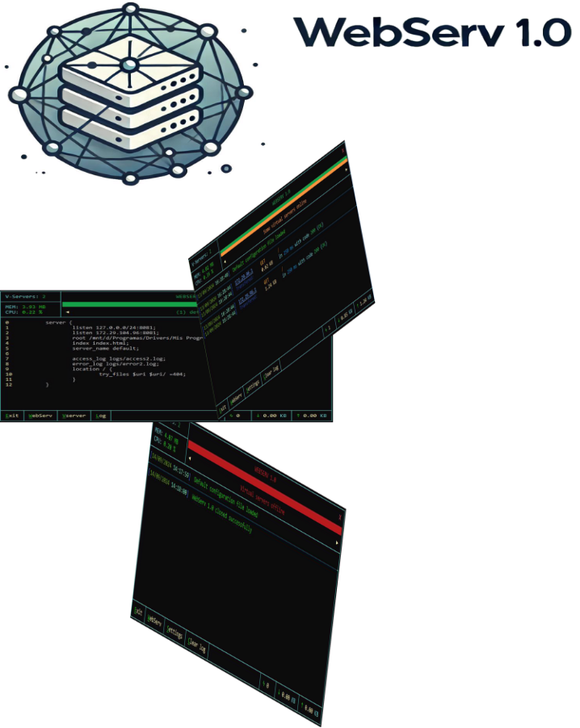
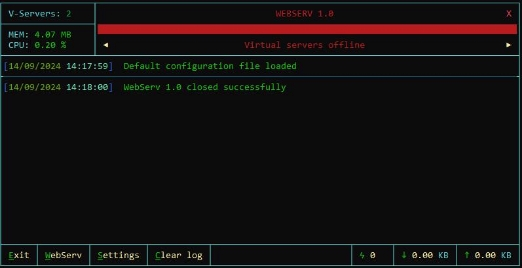
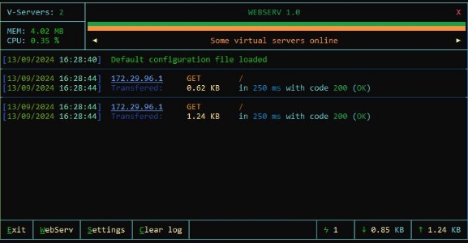
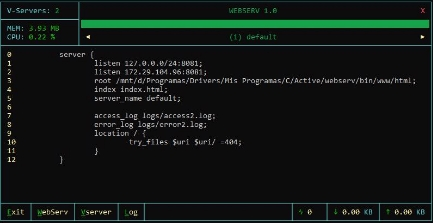
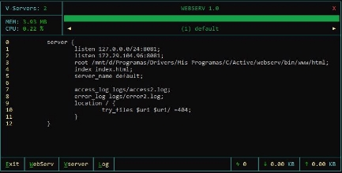
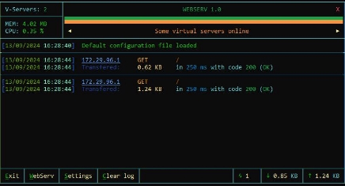



Victor J. Zurera del Valle (vzurera-) 42 Málaga - September 2024

WEBSERV 1.0

**Webserv** es un servidor web genérico con soporte para el protocolo **HTTP 1.1** programado en **C++**.

Esto quiere decir que puede servir cualquier página web sin seguridad **SSL/TLS** siempre que se configure correctamente.

**Webserv** acepta las siguientes opciones y argumentos:

./webserv [optional config file] Inicia webserv con **interfaz gráfica**. ./webserv -i [optional config file] Inicia webserv en modo **consola**. ./webserv -t [optional config file] **Valida** el archivo de configuración. ./webserv [args] & Inicia webserv en **segundo plano**.

Cuando se inicia **webserv** sin indicar un archivo de configuración, se usará el archivo predeterminado llamado **default.cfg**. Este archivo se encuentra en la misma ruta del ejecutable y si no existiera, se crearía con valores predeterminados.

El archivo de configuración puede tener cualquier nombre y extensión mientras el contenido tenga el formato correcto.

Una vez se carga y valida el archivo de configuración, se crean los **sockets** de los servidores virtuales en las direcciones y puertos especificados. Es en estas direcciones y puertos donde los clientes pueden conectarse y enviar sus peticiones.

**Webserv** permite establecer desde una sola dirección ip hasta varios rangos distintos. También se permite la misma dirección y puerto más de una vez. En algunos servidores webs esto mostraría un error. Pero en **Webserv** simplemente se aplica la primera dirección y el resto que sean iguales se ignoran.

Esto tiene un motivo.

Como se pueden usar rangos, hay posibilidades de solapamiento o de indicar un rango en un servidor virtual y una dirección individual en otro servidor virtual. En este caso, la segunda dirección ip se ignorará, ya que se crearía en el primer servidor virtual.

Pero **Webserv** permite la posibilidad de deshabilitar servidores virtuales en tiempo de ejecución. Si se deshabilita el primer servidor virtual, la dirección única del segundo servidor virtual tomaría el relevo y seguiría aceptando conexiones.

A partir de este momento, cuando ya se han creado los sockets, si un cliente se conecta y envía una petición se debe de validar, procesar y generar la respuesta apropiada.

Estas respuestas dependen de lo que solicite el cliente y de cómo esté configurado **Webserv**.

Puede ser un archivo **estático** (una página web, una imagen, un video, etc.), una **redirección** a otra URL (local o remota), un mensaje de **error**, un listado de un **directorio** o un **CGI** (véase la sección CGI para más información).

Una vez creada la respuesta, se envía al cliente.

Esto es en pocas palabras el funcionamiento de un servidor web. Por supuesto hay más partes involucradas. Pero se puede limitar a estos pasos:

- Cargar configuraciones
- Crear sockets
- Recibir petición
- Generar respuesta
- Enviar respuesta

ARCHIVO DE CONFIGURACIÓN

GLOBAL

El archivo de configuración de **WebServ** está formado por una sección **http**, que contiene la configuración **global** del servidor y los servidores virtuales. Las directivas globales se aplican a todos los servidores virtuales por defecto, pero dentro de los servidores virtuales se pueden sobreescribir sus valores. Las directivas **keep-alive** solo pueden definirse en la sección **global** y en caso de no existir, el servidor utilizará unos valores por defecto.

SERVER

La sección **server** contiene la configuración de un servidor virtual. Aquí se indica en qué **direcciones** y **puertos** escuchar y que **host** administra.

El primer servidor virtual de cada **dirección:puerto** es el servidor virtual por defecto para esa conexión.

Esto quiere decir que si no hay una coincidencia con ningún **host**, se usará este servidor para servir las peticiones.

LOCATION

Dentro de una sección **server** se pueden incluir secciones **location** que contienen instrucciones específicas para las diferentes **rutas** que puedan solicitarse.

Por ejemplo, si se envía una petición al servidor como ( ***GET /images/file.png***… ).

Si no hay una directiva ( **location )** entonces se devolverá el archivo indicado por **index** en la raíz indicada por la directiva **root**.

Si hay una directiva ( **location /** ) entonces se aplicarán las instrucciones de este.

Si además de la directiva ( **location /** ) tenemos otra directiva ( **location /images/** ), entonces se usará la que tenga mayor coincidencia con la ruta solicitada y se aplicarán las instrucciones de esta.

Estas instrucciones pueden ser desde servir el archivo solicitado, devolver una redirección, mostrar un mensaje de error, mostrar el contenido de un directorio, etc…

METHOD

Por último, las secciones **location** pueden contener secciones **method** que contienen instrucciones para los métodos html de la petición. Por ejemplo, se puede hacer que solo se permita el método **POST** a ciertas direcciones ip.

Para generar una respuesta se debe analizar la petición solicitada y determinar qué acciones tomar en base al archivo de configuración. Este proceso se realiza en orden de arriba hacia abajo ya que las directivas tienen preferencia de aparición.

No es lo mismo un “**deny all;**” seguido de un “**return 301 http://www.redireccion.com;**” que “**return 301 http://www.redireccion.com;**” seguido de “**deny all;**” En el primer caso se negaría el acceso y en el segundo se devolvería una redirección.

Cuando se recibe una petición, se debe determinar qué servidor virtual la debe manejar.

Solo los servidores virtuales que escuchen en la dirección donde se ha conectado el cliente podrá manejar esas respuestas.

Pero pueden haber varios servidores virtuales con la misma dirección y puerto (aunque realmente solo el primero de ellos tiene abierta la conexión).

El siguiente paso es determinar el servidor virtual por el **host**.

La directiva **server\_name** contiene los dominios soportados por el servidor virtual y en la petición del cliente podemos saber a cuál de ellos se ha conectado. Aunque haya dos servidores virtuales con el mismo **host**, se le asignará al primero que se encuentre.

En caso de que no se encuentre una coincidencia con ningún **host**, se usará el servidor virtual **por defecto** de esa conexión.

Una vez tenemos el servidor virtual que maneja la conexión, se comprueban las directivas **location** buscando la mayor coincidencia con la **ruta** solicitada y se aplicarán las acciones de esta.

LOGS

Las directivas relacionadas con los logs (**access\_log** y **error\_log**) pueden indicarse en todas las secciones excepto la sección **method**.

Cuando se escribe en el **log**, se buscará en la sección actual y si no se encuentra ninguna directiva de **log**, se irá descendiendo de sección hasta llegar a la sección **global**. Si no se ha encontrado, no se escribirá en el **log**.

Esto permite que diferentes servidores virtuales tengan diferentes **logs**.

Hay que destacar que los **logs** se muestran en la sección del servidor virtual aunque no se haya encontrado ninguna directiva de **logs**. En estos casos simplemente no se guardarán en el **disco**.

Para más información sobre el sistema de logs véase la sección LOGS.

EJEMPLO DE ARCHIVO DE CONFIGURACIÓN

A continuación vamos a ver un ejemplo de un archivo de configuración comentado para poder visualizar mejor la lógica explicada en la página anterior.

http { # EJEMPLO DE UN ARCHIVO DE CONFIGURACIÓN DE WEBSERV 1.0

access\_log logs/access.log; # Archivo de log access para el global error\_log logs/error.log; # Archivo de log error para el global

keepalive\_timeout 60s; # Tiempo máximo para reutilizar una conexión keepalive\_request 100; # Máximo número de peticiones en una conexión

root /var/www/; # Establece la ruta raíz

index index.php index.html; # Archivo por defecto a servir en la raíz

error\_page 404 /error\_pages/404.html; # Archivo a servir en caso de código 404

server {

listen 127.0.0.1/255.255.255.0:8080; # Escucha en el rango de ips y puerto 8080 server\_name ejemplo.com; # Administra el dominio www.ejemplo.com root /var/www/ejemplo; # Cambia la raíz solo para esta ruta

access\_log logs/access.log; # Archivo de log access para el servidor virtual error\_log logs/error.log; # Archivo de log error para el servidor virtual

location / { # Directiva location para todas las rutas

index index.html; # Archivo por defecto a servir en la raíz }

location /images/ { # Directiva location específica para la carpeta /images/

root /var/www/ejemplo/media; # Cambia la raíz solo para esta ruta

try\_files $uri $uri/ /index.html; # Intenta servir el archivo solicitado, el directorio o /index.html autoindex on; # Muestra el contenido del directorio si no se encuentra el archivo

}

location /uploads/ { # Directiva location específica para la carpeta /uploads/

root /var/www/ejemplo/uploads; # Cambia la raíz solo para esta ruta

method POST {

allow 192.168.1.0/24; # Solo se permite POST desde estas direcciones deny all; # Bloquea POST para cualquier otra IP

}

cgi PATCH cgi/my\_cgi # Manda la petición a my\_cgi si es un método PATCH method PUT DELETE {

deny all; # Bloquea PUT y DELETE para todas las direcciones }

}

}

server {

listen 127.0.0.10:8080; # Escucha en la dirección ip y puerto 8080 listen 10.24.50.15:8081; # Escucha en la dirección ip y puerto 8081 server\_name otroejemplo.com otromas.com; # Administra mas dominios

root /var/www/otros; # Establece la ruta raíz

location / { # Directiva location para todas las rutas

index index.html; # Archivo por defecto a servir en la raíz }

}

}

TABLA DE DIRECTIVAS

En la siguiente página podemos ver una tabla con todas las directivas soportadas por **Webserv**, en qué secciones pueden usarse y si puede repetirse en una misma sección.

|**DIRECTIVA**|**VALORES**|**GLOBAL**|**SERVER**|**LOCATION**|**METHOD**|**REPETIBLE**|
| - | - | - | - | - | - | - |
|**http**|Sección global del servidor web|✔|❌|❌|❌|❌|
|**access\_log error\_log**|
**access\_log** / **error\_log** [*ruta*];

Ruta = ruta donde se creará el log (relativa a la directiva **root** o absoluta)
|✔|✔|✔|❌|❌|
|**log\_rotatesize**|
**log\_rotatesize** [*tamaño*];

0 = Sin límite

Rango = 100 KB - 100 MB Sufijos válidos = B, KB, MB
|✔|✔|✔|❌|❌|
|**log\_rotate**|
**log\_rotate** [*number of files*];

0 = Sin rotación Max = 100
|✔|✔|✔|❌|❌|
|**uploads** (necesario?)|
**uploads** [*ruta*];

Ruta = ruta de la carpeta donde se guardan los archivos subidos al servidor (absoluta que se toma a partir de la directiva **root**)
|❔|❔|❔|❌|❌|
|**error\_page**|
**error\_page** [*códigos*] [*ruta*];

Códigos = códigos válidos separados por espacio

Ruta = ruta del archivo (absoluta que se toma a partir de la directiva **root**)
|✔|✔|✔|❌|✔|
|**allow deny**|
**allow** / **deny** [*dirección ip* / *all*];

all = todas las direcciones

Unica = 127.0.0.1

Rango CIDR = 127.0.0.1/24

Rango Mask = 127.0.0.1/255.255.255.0
|✔|✔|✔|✔|✔|
|**cgi**|
**cgi** [*extensiones* / *métodos*] [*ruta*];

Extensión = extensión de archivo (ex. .php, .py…) Métodos = métodos http (ex. POST, PUT…)

Ruta = ruta del CGI (relativa a la directiva **root** o absoluta)
|✔|✔|✔|❌|✔|
|**return**|
**return** [*código*] [*url*];

Código = código de estado válido

URL (opcional) = Dirección url completa o ruta relativa a la directiva **root**
|✔|✔|✔|✔|❌|
|**keepalive\_timeout**|**keepalive\_timeout** [*tiempo*] Tiempo = tiempo en segundos|✔|❌|❌|❌|❌|
|**keepalive\_request**|
**keepalive\_request** [*número*]

Número = cantidad de peticiones permitidas en una sola conexión
|✔|❌|❌|❌|❌|
|**body\_maxsize**|
**body\_maxsize** [*tamaño*];

Rango = 100 KB - 100 MB Sufijos válidos = B, KB, MB
|✔|✔|✔|❌|❌|
|**autoindex**|
**autoindex** [*on* / *off*];

Determina si se debe generar una respuesta con el contenido del directorio solicitado
|✔|✔|✔|❌|❌|
|**root**|
**root** [*ruta*];

Ruta = directorio base para servir las peticiones
|✔|✔|✔|❌|❌|
|**index**|
**index** [*archivos*];

Archivos = archivos separados por espacio que se usarán para la respuesta predeterminada en orden de preferencia
|✔|✔|✔|❌|❌|
|**server**|
**server** { }

Sección de un **servidor virtual**
|✔|❌|❌|❌|✔|
|**listen**|
**listen** [*dirección ip***:***puerto*];

Dirección IP = dirección ip donde escuchar conexiones entrantes Unica = 127.0.0.1

Rango CIDR = 127.0.0.1/24

Rango Mask = 127.0.0.1/255.255.255.0

Puerto = puerto donde se escuchará por conexiones entrantes
|❌|✔|❌|❌|✔|
|**server\_name**|
**server\_name** [*hosts*];

Hosts = nombre de los dominios separados por espacio a los que se aplica el servidor virtual (ex. example.com personal.es)
|❌|✔|❌|❌|❌|
|**location**|
**location** { [*=*] [*ruta*] } Sección de un **location**

Signo igual = la ruta solicitada debe ser idéntica a la ruta indicada Ruta = ruta del location (relativa a la directiva **root**)
|❌|✔|❌|❌|✔|
|**DIRECTIVA**|**VALORES**|**GLOBAL**|**SERVER**|**LOCATION**|**METHOD**|**REPETIBLE**|
|**try\_files**|
**try\_files** [*archivos*] [*ruta*];

Archivos = archivos o directorios (si **autoindex on**) en orden de preferencia que se servirán.

Ruta = Si hay disponible ningún archivo, se servirá el contenido de la ruta (relativa a la directiva **root**)
|❌|❌|✔|❌|❌|
|**alias**|
**alias** [*ruta*];

Ruta = ruta que sustituye a la ruta del **location** (relativa a la directiva **root** o absoluta)
|❌|❌|✔|❌|❌|
|**internal**|
**internal**;

Indica que la sección location solo puede ser accedida por el servidor. Las solicitudes externas no se aplicarán.

Solo puede accederse a través de un try\_files
|❌|❌|✔|❌|❌|
|**method**|
**method** { [*métodos*] } Sección de un **method**

Métodos = métodos http en los que se aplicará la sección (ex. POST, PUT…)
|❌|❌|✔|❌|✔|

VARIABLES

En el archivo de configuración se pueden usar **variables** que contienen valores de las peticiones de los clientes.

Estas **variables** se deben crear usando el encabezado de la petición y son importantes porque el archivo de configuración puede incluirlas para determinar el tipo de respuesta que debe ser generada.

A continuación hay una explicación de todas las **variables** y sus valores.

EJEMPLO DE UNA SOLICITUD DE UN CLIENTE

GET /products/details?item=123&color=red HTTP/1.1

Host: www.example.com

User-Agent: Mozilla/5.0 (Windows NT 10.0; Win64; x64) AppleWebKit/537.36 (KHTML, like Gecko) Chrome/85.0.4183.121 Safari/537.36 Referer: https://www.google.com/search?q=webserv

Cookie: sessionid=abcdef1234567890; theme=dark

**$request\_uri** Es la **URI completa** incluyendo la cadena de consulta (**query string**) /products/details?item=123&color=red **~~$uri, $document\_uri~~** Es la **URI** sin incluir la cadena de consulta (**query string**). /products/details **$args, $query\_string** Es la cadena de consulta (**query string**), que contiene los parámetros enviados después de ? item=123&color=red **$request** La **solicitud** completa. GET/products/details?item=123&color=red HTTP/1.1 **$request\_method** El **método** HTTP utilizado en la solicitud (GET, POST, PUT, DELETE, etc.). GET **$host** El nombre del **host** solicitado. Si no se especifica, se usa **server\_name** o la dirección IP del servidor. www.example.com **$remote\_addr** La **dirección IP** del cliente que hizo la solicitud. 203.0.113.45 **$remote\_port** El **puerto** del cliente que hizo la solicitud. 54321 **$server\_addr** La **dirección IP** del servidor que está manejando la solicitud. 192.168.1.10 **$server\_port** El **puerto** del servidor que está manejando la solicitud. 80 **$server\_name** El **nombre** del servidor virtual que está manejando la solicitud. www.example.com **$http\_referer** El valor de **referer**, que indica la página anterior a la que se hizo la solicitud https://www.google.com/search?q=webserv **$http\_cookie** El valor de la **cookie** enviada en la solicitud HTTP. sessionid=abcdef1234567890; theme=dark **$http\_host** El valor del encabezado **host**, que es el nombre del dominio o la dirección IP solicitada. www.example.com **$http\_user\_agent** El contenido del encabezado **user-agent**, que identifica el navegador del cliente. Mozilla/5.0 (Windows NT 10.0; Win64; x64)...

LOGS

**Webserv** soporta dos tipos de logs, **memory logs** y **local logs**

- **Memory logs** Se mantienen en memoria y se muestran en la interfaz.

En la sección general se muestran todos los logs (general y servidores virtuales).

En cada servidor virtual se muestran sus propios logs.

Los **memory logs** muestran tanto los logs de **access** como los de **error**.

Para evitar un excesivo uso de memoria, se muestran solamente los últimos **200 logs**.

- **Local logs** Estos logs diferencian entre **access** y **error** y se guardan en **disco**.

Solamente se crearán si se ha especificado su ubicación en el archivo de configuración.

Usan el programa **logrotate** para realizar la **rotación de logs** en base a un **tamaño máximo**. Para establecer las rutas de los logs en disco, hay que añadir las directivas **access\_log** y **error\_log** al archivo de configuración.

Estas directivas pueden estar en las secciones **global**, **server** y **location**, teniendo preferencia la de mayor profundidad. Es decir, **location** prevalece sobre **server** y este sobre **global**.

La ruta a donde se creará el log debe existir para que se pueda crear el log. Esto quiere decir que webserv no creará las carpetas, solo el archivo del log en caso de que no exista.

La ruta puede ser absoluta o relativa a la ubicación del ejecutable.

**access\_log** ~/my\_log.txt Esto creará el log en la ruta **home** del usuario.

**access\_log** /var/log/my\_log.txt Esto creará el log en una ruta **absoluta**.

**access\_log** log/my\_log.txt Esto creará el log dentro del directorio “**log**” en la ruta donde se encuentra el ejecutable

de **Webserv**. Esto ocurre porque es una ruta relativa.

Aparte de la ubicación de los logs, también se pueden establecer dos directivas en la configuración que controlan la rotación de los logs en disco. **log\_rotatesize** [*tamaño*] Con esta directiva indicamos el **tamaño máximo** del log antes de que se pueda **rotar**.

Esto no quiere decir que se rotará cuando llegue a ese tamaño, lo que quiere decir es que **logrotate** rotará el log cuando sea **igual** o **mayor** a este tamaño.

El tamaño puede ser **0**, que indica que **deshabilita** la rotación, o entre **1 KB** y **100 MB**. Permite los sufijos **KB** y **MB**.

Si no se **establece** en la configuración, se usará un valor **por defecto** de **1 MB**.

**log\_rotate** [*número de archivos*] Indica cuantos archivos deben **crearse**. Quiere decir que cuando un log llega al tamaño de

rotación, se creará un **archivo nuevo** hasta llegar al **límite** indicado en la directiva.

El log mas antiguo se **eliminará** en caso de ser necesario para una nueva rotación.

Los valores pueden ser desde **0** (no se creará un archivo) hasta **100** archivos.

En caso de que se establezca en 0, no se creará ningún archivo, pero esto no evita que el log actual se elimine, ya que la rotación se produce cuando el log sea igual o mayor a **log\_rotatesize**. Si no se **establece** en la configuración, se usará un valor **por defecto** de **7 archivos**.

CÓDIGO

La clase **Log** consta de tres partes.

INSTANCIABLE

Es la parte de la clase que se puede **instanciar** en un objeto. Esta parte contiene los contenedores para guardar los logs de **access**, **error** y **both** (ambos combinados).

Tiene métodos para **añadir** logs y **vaciarlos**.

Tanto los datos globales como los servidores virtuales tienen un objeto **Log** para almacenar los logs.

ESTÁTICA

La parte **estática** no necesita ser **instanciada** y pueden llamarse a sus métodos desde cualquier ubicación que tenga declarada la clase **Log**. Esta parte se encarga de **añadir** los logs a los objetos instanciados, guardarlos en **disco** y hacer la llamada a **logrotate** al finalizar el programa.

Para añadir un log que se muestre en la interfaz o se guarde en disco tenemos que usar el método **Log::log()**.

Hay dos implementaciones de este método. Una para añadir un log de cualquier tipo y otra específica para añadir un log de un cliente.

El método **normal** requiere al menos dos argumentos, el **texto** del log y el **tipo**. Opcionalmente se pueden indicar el **servidor virtual** al que pertenece (por defecto se usa **global**) y el **map** con los datos donde se deben obtener los valores para guardarlo en **disco**.

El método de un **cliente** requiere el **method** (GET, POST, etc.), la **ruta del recurso** solicitada, el **código** devuelto al cliente, el **tiempo** que ha tardado en procesar la solicitud y la **dirección IP** del cliente. Opcionalmente, como en la otra implementación, se puede indicar el **servidor virtual** y el **map**.

El método de un **cliente** llama al método **normal** para crear los logs correspondientes usando la información pasada en sus argumentos.

Antes de ver unos ejemplos, hay que aclarar que el valor del argumento **type** es un enumerador con los siguientes valores posibles:

enum e\_type { MEM\_ACCESS, MEM\_ERROR, VSERV\_ACCESS, VSERV\_ERROR, GLOBAL\_ACCESS, GLOBAL\_ERROR, BOTH\_ACCESS, BOTH\_ERROR, LOCAL\_ACCESS, LOCAL\_ERROR };

**MEM\_ACCESS MEM\_ERROR** Añade el log al global y al servidor virtual pasado como argumento.

**VSERV\_ACCESS VSERV\_ERROR** Añade el log al servidor virtual pasado como argumento.

**GLOBAL\_ACCESS GLOBA\_ERROR** Añade el log al global solamente.

**BOTH\_ACCESS BOTH\_ERROR** Añade el log al global y al servidor virtual pasado como argumento y lo guarda en disco. **LOCAL\_ACCESS LOCAL\_ERROR** No añade el log pero lo guarda en disco para el global y el servidor virtual pasado como argumento.

A los logs se les añade la **fecha** y **hora** para tener un control temporal de la situación del servidor.

Log::log(“Esto es un log”, Log::MEM\_ACCESS); Ejemplo de un l**og de memoria**.

Log::log(“Esto es un log”, Log::BOTH\_ERROR, VServ, VServ->Loc[0].data); Ejemplo de un log que se **guarda en memoria** y en **disco**.

Se indica a qué **servidor virtual** pertenece y la información se obtendrá de su primer **location**.

THREAD

Para no **bloquear** las conexiones de los clientes, todo el proceso de guardado de los logs se realiza en un **hilo** independiente. Esto permite mantener **separadas** la parte dedicada a recibir y procesar peticiones de clientes y el sistema de logs.

Cuando se inicia **Webserv** se crea un **hilo** para administrar los logs y que se mantiene en un **while** hasta que se establezca la variable **Log::terminate** en **true**, lo cual ocurre cuando termina el programa.

Cada cierto **intervalo** de tiempo comprueba si hay logs que procesar y en caso de haberlos, procesa los logs añadiendoles a los objetos **Log** y guardandolos en **disco** (dependiendo del **tipo** de log).

El proceso es el siguiente:

- **Se crea el hilo de los logs** En un **while** se comprueba si hay logs pendientes de procesar.
- **Se añade un log** Se **añade** un log a una lista de logs pendientes de procesar.
- **Se detectan logs pendientes de procesar** Se **copian** los logs a una lista **local** y se **vacían** los logs pendientes.
- **Se procesan los logs en la copia loca**l El motivo de la **copia** es evitar **bloquear** el **hilo principal** con un **mutex**.
- **Se solicita una actualización de la interfaz** Si se han añadido **memory logs** se actualiza la interfaz para verlos en la terminal.

Este proceso evita tener esperando al **hilo principal** en un **mutex**, ya que hay que evitar que se añadan nuevos logs mientras se están procesando los que ya existe.

Para conseguir esto se usa el **mutex** solamente para hacer una **swap** de los logs pendientes por los de una lista de logs vacíos. Por último, una breve explicación de cómo funciona la rotación de logs con **logrotate**.

Debido a la limitación de **logrotate** y los **permisos de administrador**, solamente se puede usar **logrotate** llamando directamente al **ejecutable**. Esto es así porque para añadir la configuración de **logrotate** es necesario disponer de permisos de administrador.

La solución actual es **crear** un archivo temporal con la configuración para la rotación de los logs, ejecutar **logrotate** y **eliminar** el archivo temporal. Esto se realiza cuando se cierra **Webserv**.

**NOTA**: En teoría debería funcionar, pero no he tenido ocasión de comprobarlo.

DISPLAY

**Webserv** se ejecuta por defecto en modo **interfaz**.

En este modo se muestra en la terminal una ventana que ajusta su tamaño automáticamente y muestra información del servidor de manera visual e interactiva.

La interfaz se divide en varias partes:

- **Información de los recursos** Aquí se muestra el número de **servidores virtuales activos**. 

La memoria **RAM** usada por el servidor. 

El uso de **CPU** del servidor. 

- **Versión y estado del servidor** En el título de la ventana se muestra el nombre y la versión del servidor.

Se muestra en verde cuando está funcionando correctamente y en rojo cuando no está activo.

- **Servidores virtuales** Debajo del título se muestran los servidores virtuales. ![ref1]

Con las teclas puedes seleccionar el servidor virtual.

Además de los servidores virtuales está la sección general que muestra los logs de todos los servidores virtuales y los globales.

Igual que en el título, el color indica el estado del servidor virtual.

En la sección general, se mostrará en color naranja cuando hay algún servidor virtual activo, pero también los hay desactivados.

- **Logs and settings** Esta parte muestra los **logs** del servidor virtual o su **configuración**

Use la **tecla** indicada en el **panel de botones** para seleccionar cual visualizar. Puede desplazarse en los logs o la configuración usando las teclas![ref2]![ref3]

- **Panel de botones** Este panel muestra las **acciones** posibles en la sección actual.

Para ejecutar la acción, pulse la **tecla** correspondiente

con la letra **marcada** en los botones.

- **Información de la conexión** Por último tenemos la información sobre las conexiones.

Esto incluye el número de clientes conectados y la

cantidad total de bytes de datos recibidos y enviados.

En el modo **consola (-i)** solamente se muestran los ![ref4]logs y para cerrar Webserv hay que pulsar **CTRL + C**. 

En el modo **validación (-t)** se muestran solamente los errores de configuración si los hubiera o un mensaje indicando que el archivo de configuración es válido. 

Cuando se ejecuta en **segundo plano (&)** no se muestra ningún tipo de información. 

CÓDIGO

La clase **Display** es totalmente estática y es la encargada de dibujar la interfaz. Al igual que la clase **Log**, se ejecuta en un **hilo** independiente para evitar que la lógica de las conexiones con el cliente se vean afectadas por la escritura en la terminal, la cúal es muy lenta, ya que debe de actualizar la terminal completa y no solo una línea de texto.

Dentro de la clase **Display** tenemos varias partes que se encargan de diferentes acciones.

RAW MODE

Para poder dibujar la **interfaz** correctamente, hay que establecer la terminal en un modo especial que **desactiva** el buffer de entrada. Además se **oculta** el cursor para evitar que la línea blanca aparezca por todos lados.

Antes de salir de **Webserv** hay que restablecer la terminal.

SEÑALES

En la clase **Display** también se administran las señales. Estas incluyen las siguientes:

- **SIGINT (CTRL + C)** Cuando se recibe esta señal, el **Webserv** cierra las conexiones y sale limpiamente.
- **SIGQUIT (CTRL + \)** Igual que **SIGINT**, se cierran las conexiones y se sale limpiamente.
- **SIGWINCH (Redimensión)** Se produce al **redimensionar** la terminal. Envía una solicitud de actualización de la interfaz.
- **SIGTSTP (CTRL + Z)** Envía el proceso a **segundo plano**, pero detiene el servidor al hacerlo.
- **SIGCONT (Resume) Restaura** el proceso después de enviarlo a segundo plano.

Es importante saber que al enviar el proceso a segundo plano **(CTRL + Z)**, el proceso se queda latente hasta que se restaura. Esto hace que las conexiones entrantes no se puedan aceptar y las solicitudes que estuvieran procesando se detendrían.

Esto no ocurre cuando se ejecuta el **Webserv** en modo de **segundo plano (&)**. En este modo el proceso se ejecuta normalmente, pero no se verá ninguna información en la terminal.

INPUT

Cuando el usuario realiza una pulsación de tecla, esta se analiza y si es una tecla que permite ejecutar una acción, se ejecutará. Webserv acepta estas teclas (excluyendo las señales):

- **Flechas Izquierda y Derecha**
- **Flechas Arriba y Abajo**
- **Teclas Inicio y Fin**
- **Tecla W**
- **Tecla V**
- **Tecla S**
- **Tecla L**
- **Tecla C**
- **Tecla E**
- **Tecla R**

**Selecciona** los servidores virtuales.

**Desplazamiento** en los logs y configuraciones.

Ir al **inicio** o **final** de los logs o la configuración. **Des/Habilitar** el servidor web.

**Des/Habilitar** el servidor virtual seleccionado.

**Mostrar la configuración** del servidor virtual.

**Mostrar los logs** del servidor virtual.

**Vaciar** la lista de logs del servidor virtual.

**Cerrar** todas las conexiones y salir limpiamente de **Webserv**. **Resetea** la terminal y vuelve a dibujar la interfaz.

OUTPUT

Esta parte del código se encarga de **construir** la interfaz e **imprimirla** en la terminal.

Para solicitar una actualización de la interfaz, hay que llamar a la función **Display::update()**.

THREAD

Como ya se ha indicado, la clase **Display** se ejecuta en un **hilo** y por lo tanto necesita las funciones para mantener el **hilo** en ejecución. Al igual que con la clase **Log**, **Display** usa un **while** para comprobar si se requiere una actualización de la interfaz.

Si la variable **Display::terminate** es **true**, se termina la ejecución del **hilo**.

Es importante **recalcar** la necesidad de realizar el dibujado de la interfaz en un **hilo**, ya que el dibujado es un proceso **muy lento** y de ejecutarse en el **hilo principal**, la capacidad de administrar la conexiones y servir las peticiones a los clientes se vería **tremendamente reducida**.

El funcionamiento es muy sencillo (al menos la lógica, la implementación es algo más compleja) y los pasos son los siguientes:

- **Se crea el hilo del display** En un **while** se comprueba si hay alguna petición de actualización de la interfaz.
- **Se solicita una actualización de la interfaz** Se ejecuta la función que **genera** todo el texto que se debe imprimir en la terminal.
- **Se imprime la interfaz en la terminal** Es posible que falle la **impresión** de todo el texto y se intente varias veces.

CONEXIONES

La administración de las conexiones se realiza en la clase estática **Net** y es la encargada de crear los **sockets**, aceptar nuevos **clientes** y **transferir** los datos entre el servidor y los clientes.

Cuando **Webserv** se inicia y carga la configuración, se procede a generar una lista de direcciones y puertos donde deben crearse sockets para escuchar por solicitudes de conexión.

Cuando se crea un **socket**, se crea también un objeto **SocketInfo** que incluye la información del socket, como el **descriptor de archivo (FD)**, la **dirección IP** y **puerto**, el **servidor virtual** al que pertenece y una **lista de clientes** conectados al socket.

Además de crear un **SocketInfo**, también se crea un objeto **EventInfo** que incluye más información todavía (vease la sección EVENTINFO).

La clase Net tiene un contenedor map que almacena todos los EventInfo usando su **FD** como clave. Esto permite poder acceder a toda la información del EventInfo solamente con conocer el descriptor de archivo.

El siguiente paso es añadir a **EPOLL** el **FD** del socket.

Vamos a explicar el funcionamiento de **EPOLL** antes de continuar con el socket que hemos creado.

EPOLL

**EPOLL** es un sistema de **monitorización de eventos** del kernel de linux y está diseñado para ser muy eficiente en la gestión de múltiples descriptores de archivos.

A diferencia de otros métodos como **POLL** o **SELECT**, **EPOLL** es más eficiente porque solo se enfoca en los descriptores de archivos que están listos para realizar operaciones (lectura, escritura, etc.), en lugar de recorrer todos los descriptores cada vez.

Esto lo hace ideal para sistemas que manejan un gran número de conexiones, como servidores web.

Primero se inicializa **EPOLL** que irónicamente devuelve un descriptor de archivo.

Luego se añaden los descriptores de archivo que queremos que gestione **EPOLL**.

Por último, se llama a la función **epoll\_wait()** que nos devolverá la cantidad de eventos que se han producido.

Aunque simplificado un poco (véase el código para más detalles), después de llamar a **epoll\_wait()** se recorre un **array** que contiene todos los **FD** que están listos para leer o escribir.

Esto se traduce en que si hay un evento listo para ser leído, es porque tiene datos esperando. Puede ser una **solicitud** de conexión, una **petición** de un cliente, un **archivo** que se está leyendo del disco y la salida de un **CGI**.

Igualmente, cuando un **FD** está listo para ser escrito es para enviar una **respuesta** a un cliente, enviar datos a un **CGI**, etc…

Si eres un listillo (seguro que sí), te habrás dado cuenta que normalmente un **FD** que puede aceptar datos casi siempre está listo para recibirlos. Esto haría que se generase el evento en cada iteración de **epoll\_wait()**.

Por este motivo se modifica el tipo de evento en **EPOLL** para que avise cuando está listo para escritura sólo cuando realmente tengamos algo que escribir. Una vez finalizada la escritura, se modifica el evento de nuevo para que solo monitorice cuando hay datos para leer.

Así que resumiendo, **EPOLL** nos avisa cuando llegan datos y cuando podemos escribir datos de manera óptima.

Un detalle importante del uso de **EPOLL** es que nos seguirá avisando siempre que haya datos por leer o se pueda escribir en un FD. Esto nos permite leer y escribir en fragmentos, lo cual es más óptimo que hacerlo todo de una vez.

Pongamos una situación. Tenemos que enviar un archivo de ¡¡¡ **1 GB** !!! a un cliente.

Si lo hiciéramos de una vez, tendríamos al resto de clientes **esperando** a que se complete la transferencia. Esto no es aceptable, al menos para los otros clientes.

Gracias a **EPOLL** podemos leer **pequeños fragmentos** del archivo y enviarlo mientras se atienden al resto de clientes.

Cuando se ha terminado de leer el archivo y se ha enviado la última parte al cliente, se modifica el evento para que solo nos avise cuando el cliente realice otra petición.

Continuando donde lo dejamos, tenemos el socket gestionado por **EPOLL**. Si un cliente se conecta a ese socket, **EPOLL** nos avisa de que hay datos para ser leídos. Creamos un objeto **Client** que tiene la información del cliente, un **FD** para comunicarnos con el cliente y un **EventInfo** para el cliente.

Añadimos el **EventInfo** a la lista de todos los **EventInfo** y el **FD** a **EPOLL**.

A partir de ahora **EPOLL** nos avisará cuando el cliente realice una petición.

CÓDIGO

La clase **Net** es también **estática** y se podría dividir en la siguientes partes:

VARIABLES

Las variables de la clase **Net** son las siguientes:

- **sockets** Una lista con todos los **sockets** creados.
- **clients** Una lista con todos los **clientes** conectados.
- **events** Una lista (**FD** - **EventInfo**) con todos los eventos.
- **cache** Una instancia de la clase **Cache**.

Las siguientes variables interactúan con la clase **Display** y por lo tanto deben ser protegidas con **mutex**.

- **total\_clients** Total de clientes **conectados**.
- **read\_bytes** Total de bytes **recibidos**.
- **write\_bytes** Total de bytes **enviados**.
- **do\_cleanup** Indica que debe realizarse una **comprobación** en los sockets cuando se ha eliminado un cliente.
- **ask\_socket** Indica que deben **crearse** o **cerrarse** todas las conexiones (cuando se pulsa con la **tecla W**).
- **socket\_action\_list** Lista de servidores virtuales que deben **cambiar** su estado (cuando se pulsa con la **tecla V**).

SOCKETINFO

Esta estructura de datos contiene información del **socket** asociado. El contenido de **SocketInfo** es el siguiente:

- **fd** Es el **descriptor de archivo** al que pertenece (en este caso de un socket).
- **IP Dirección IP** del socket.
- **port Puerto** del socket.
- **VServ** Un **puntero** al servidor virtual al que pertenece.
- **clients** Una **lista** de clientes conectados al socket.

EVENTINFO

Esta estructura de datos contiene información de los objetos asociados a un **FD** y es una de las partes principales del servidor web, ya que permiten procesar los datos de cada **socket**, **cliente**, **archivo** o **CGI** de manera sencilla y eficaz.

El contenido de **EventInfo** es el siguiente:

- **fd** Es el **descriptor de archivo** al que pertenece.
- **type** El **tipo** de evento (socket, client, data o CGI).
- **socket** Un **puntero** al socket al que pertenece el evento.
- **client** Un **puntero** al cliente al que pertenece (si es aplicable).
- **read\_buffer Buffer** para almacenar los datos leídos.
- **write\_buffer Buffer** para almacenar los datos a enviar.
- **request Contenido** de la petición completa.
- **path Ruta al archivo** (si es un evento de un archivo).
- **no\_cache** Indica que **no** se debe **guardar** en caché el archivo.
- **close** Indica que se debe **cerrar** la conexión con el cliente después de enviar los datos.

CLIENT

La clase **Client** es **instanciable**, y contiene información del cliente conectado. El contenido de **Client** es el siguiente:

- **fd** Es el **descriptor de archivo** del cliente.
- **socket Puntero** al socket al que pertenece.
- **IP Dirección IP** del cliente.
- **port Puerto** del cliente.
- **last\_activity** Última **actividad** en el servidor (usado para **keep-alive**).
- **total\_requests** Total de **peticiones** realizadas (usado para **keep-alive**).

La clase **Client** tiene solamente tres métodos.

- **check\_timeout Comprueba** si una conexión ha expirado (time-out) y la **cierra**.
- **update\_last\_activity Resetea** el tiempo de expiración (time-out).
- **remove Cierra** la conexión y **elimina** el cliente de la lista de clientes.

Hasta ahora hemos visto los objetos y variables que pertenecen a la clase **Net**, ahora veremos sus métodos.

SOCKET

Estas funciones nos permiten crear, cerrar, aceptar, habilitar y deshabilitar sockets.

- **Create Crea** uno o todos los sockets de los servidores virtuales habilitados.
- **Close Cierra** y **elimina** uno o todos los sockets.
- **Accept Acepta** la conexión de un cliente y le asigna un **EventInfo**.
- **Status Cambia** el estado de Webserv o sus servidores virtuales. (**teclas W** y **V**).

CREAR SOCKET

Para **crear** los sockets, se **genera** una lista de todas las direcciones IP y puertos que deben crearse usando los servidores virtuales **habilitados**.

Esto no quiere decir que el socket se pueda crear correctamente, ya que el puerto puede no estar disponible, la dirección IP no ser válida o ya se creó un socket con esa dirección y puerto.

En caso de **fallo** al crear el socket, se **ignora** y se continúa con el siguiente socket.

Cuando se crea un socket, se añade a la lista de sockets se vincula con un **EventInfo** y se añade a **EPOLL**.

ACEPTAR CONEXIÓN

Si el socket recibe una **solicitud** de conexión de un **cliente**, Se crea un objeto **Client**, se añade a la lista de clientes del socket y de **Net**, se vincula con un **EventInfo** y se añade el cliente a **EPOLL**.

CERRAR SOCKET

Cuando se cierra una conexión, se cierran también los clientes conectados a ese socket, se elimina el EventInfo del socket y se elimina de EPOLL.

CAMBIAR ESTADO

Con **cambiar** el estado de un socket me refiero a cuando el usuario **pulsa** la tecla **V** o **W** para cambiar el estado a un servidor virtual o el servidor al completo.

Realmente los sockets están **vinculados** con los servidores virtuales, por eso al cambiar sus estados deben **crearse** o **cerrarse** los sockets.

Como el **estado** de los servidores virtuales se puede ver en la **interfaz** y esta está en otro **hilo** de ejecución, es necesario proteger con **mutex** los accesos al estado de los servidores virtuales.

Para ello se usan **variables** que indican si se debe aplicar algún **cambio** de estado y cual.

En cada iteración de **EPOLL** se comprueba si hay algún cambio de estado pendiente y se realiza.

EVENTS

Estas funciones interactúan con la lista de **EventInfo**.

CREAR EVENTO

No hay una función **específica** para crear un **EventInfo**.

El **EventInfo** se crea directamente al **añadirlo** a la lista de **EventInfo** con las propiedades necesarias dependiendo de la situación, y se realiza en las funciones donde sea necesaria su creación (crear un socket, aceptar un cliente, etc.).

OBTENER EVENTO

Esta función simplemente obtienen el **EventInfo** asociado a un **FD**.

ELIMINAR EVENTO

Podemos eliminar un **EventInfo** de un **FD**, todos los **EventInfo** de un **cliente** o **todos** los que se han creado.

Hay que **aclarar** que cuando hablamos de todos los **EventInfo** de un cliente, no quiere decir que un cliente pueda tener más de un **EventInfo** asociado. Lo que ocurre es que cuando se crea un **EventInfo** para un **archivo** o un **CGI** que debe enviar datos a un cliente, este **EventInfo** mantiene el puntero al cliente con el que interactúa. Si se **cierra** ese cliente, los **EventInfo** con los que se relaciona dejan de tener utilidad y por lo tanto se **eliminan** también.

EPOLL

Sus funciones nos permiten **crear**, **cerrar**, **añadir**, **modificar** y **eliminar** eventos a **EPOLL**, así como **obtener** los eventos que hay que procesar.

- **Create Crea** la instancia principal de **EPOLL**.
- **Close Cierra** la instancia principal de **EPOLL**.
- **Add Añade** un evento a **EPOLL**.
- **Set Modifica** un evento de **EPOLL**.
- **Del Elimina** un evento de **EPOLL**.
- **Events Obtiene** la lista de eventos que se deben procesar.
- **Time-Out** Permite **crear** y **comprobar** el time-out de los clientes (usado para **keep-alive**).

CREAR

En esta función se **crea** tanto el **EPOLL** como el **FD** encargado de **monitorizar** los **time-out** de los clientes.

El **FD** del **time-out** es **especial** en el sentido de que **genera** automáticamente datos para ser leídos cada **intervalo** de tiempo. Esto hace que **EPOLL** pueda recibir el evento de **time-out** en intervalos regulares y realizar las **comprobaciones**.

Por defecto el intervalo está establecido en **1000 ms**.

Si falla la creación de **EPOLL**, **Webserv** no podrá funcionar correctamente.

Si falla la creación de **time-out**, simplemente no se comprobarán los **time-outs** de los clientes.

CERRAR

Al contrario que al crear **EPOLL**, aquí se **cierra**, tanto la instancia principal como el **time-out**.

AÑADIR

Esta función nos permite **añadir** eventos a **EPOLL**. Se le debe pasar por argumento el descriptor de archivo (**FD**) y qué acciones debe monitorizar (**EPOLLIN** y **EPOLLOUT**). Esto significa cuando hay datos para leer y datos para escribir.

MODIFICAR

**Modifica** un evento de **EPOLL**. Acepta los mismos argumentos que la función añadir.

ELIMINAR

**Elimina** un evento de **EPOLL**. Se le debe pasar el descriptor de archivo (**FD**) del evento.

~~OBTENER~~

Esta función es algo más compleja. Primero se **crea** un array de **epoll\_event** que contendrá los eventos que deben ser procesados.

Después se llama a la función **epoll\_wait()**.

Esta función recibe como argumentos el **FD** de la instancia principal de **EPOLL**, el **array** que acabamos de crear, el **número** de eventos que se procesarán como máximo por iteración y por último el **tiempo** que debe esperar si no se produce ningún evento.

Este último argumento es importante, ya que la función **epoll\_wait()** es **bloqueante** y si no indicamos este último argumento, se quedará **bloqueado** hasta que se produzca un evento, lo cual puede no ocurrir nunca.

Si, es cierto que el **FD** de **time-out** produce un evento cada **1000 ms**, pero si fallara la creación de este, no se produciría. Además, en esta función también se comprueba si hay que procesar **cambios** de estado de los servidores virtuales (teclas **V** y **W**) y lo más apropiado es que desde que se pulsa la tecla y se produce el efecto no pasen más de unos milisegundos, no varios segundos.

Al indicarle un tiempo (**100 ms** por defecto) a **epoll\_wait()**, este **saldrá** de la espera aunque no se haya producido ningún evento, **comprobará** si hay que realizar alguna tarea (estado de los servidores virtuales o hacer limpieza en algún socket) y **volverá** a llamarse a **epoll\_wait()**.

Cuando sí que se **produce** un evento, se comprueba el **tipo** de evento (**EPOLLIN** o **EPOLLOUT**) y se llama a la función correspondiente en base del tipo de **EventInfo** (socket, client, data, CGI, etc.).

TIME-OUT

Como ya hemos indicado, al **crear** la instancia principal de **EPOLL** se llama a la función que **crea** el **FD** de **time-out**.

En esta función se **crea** el descriptor de archivo con el **intervalo** de tiempo que queramos para que **genere** eventos de escritura.

En la función **check\_timeout()** se llama a la función con el mismo nombre en cada **cliente** conectado y desde esa función se determina si se debe **cerrar** el cliente porque ha **expirado** su tiempo máximo de inactividad.

COMUNICATIONS

Estas funciones se encargan de **leer** y **escribir** en los descriptores de archivos (**FD**) de los **clientes**, **archivos** o **CGI**. Se podría dividir de la siguiente manera:

CLIENTE (LEER)

Cuando hay datos para **leer** de un cliente, primero se determina si es el **último fragmento** de datos. Para conseguir esto se usa la función **recv** que permite ojear (**peek**) un **FD** sin modificar sus datos.

Cuando leemos datos de un descriptor de archivos (**FD**), usamos la función **recv** (read en otros contextos) con tres parámetros, el **FD** desde el que queremos leer, un **buffer** donde se almacenarán los datos leídos y el número de **bytes** que queremos leer.

Consideremos este escenario: si hay **500 bytes** disponibles en el **FD** y pedimos leer **1024 bytes**, **recv** nos devolverá **500 bytes**, indicando que no hay más datos disponibles por el momento. En este caso, sabemos que hemos leído todo lo que había.

Ahora, si el **FD** tiene más de 1024 bytes, digamos **1500 bytes**, **recv** nos devolverá **1024 bytes**, lo que indica que aún quedan datos por leer. En esta situación, el sistema producirá otro evento con **EPOLL**, y el ciclo de lectura continuará hasta que todos los datos hayan sido recibidos.

Sin embargo, surge un problema cuando el cliente envía exactamente **1024 bytes** (coincidiendo con el tamaño del buffer que usamos en cada lectura). Si leemos justo esos **1024 bytes**, **recv** nos devolverá 1024, pero no sabremos si hemos recibido todo o si hay más datos pendientes.

Dado que no hemos recibido menos de lo solicitado, podríamos asumir erróneamente que aún hay más datos, pero **EPOLL** no generará otro evento, ya que efectivamente hemos leído todo.

Este problema provoca que el servidor **no procese** completamente la petición hasta que el cliente **envíe más** datos, lo que podría terminar mezclando solicitudes y causando errores en la comunicación.

Para evitar esto, una **solución** es hacer un "**peek**" con **recv**, es decir, echar un vistazo a los datos **sin eliminarlos** del buffer.

Si solicitamos leer **1024 + 1 bytes**, podremos determinar si hay más datos por llegar. Si al ojear detectamos que hay más de **1024 bytes**, sabremos que debemos seguir leyendo. Si no, podemos concluir que ya hemos recibido todos los datos.

Este enfoque nos permite manejar correctamente situaciones donde el tamaño de los datos recibidos coincide exactamente con el tamaño del buffer de lectura, evitando problemas en la gestión de las solicitudes.

Por lo tanto, el primer paso en la lectura de datos es determinar si una vez leído el fragmento de datos aún quedarán más datos por ser leídos.

Luego se procede a **leer** el fragmento, **guardarlo** en el buffer de lectura que contiene todos los datos leídos, **actualizar** la variable del total de bytes leídos y **aumentar** la variable del total de peticiones del cliente (para **keep-alive**).

Si se **terminó** de leer todos los datos, se llama a la función encargada de **procesar** la petición.

CLIENTE (ESCRIBIR)

Para escribir en un **FD** de un cliente el proceso es parecido a la lectura, pero en este caso sabemos la cantidad de datos que se deben escribir y no necesitamos hacer un **peek**.

En cada **iteración** de **EPOLL** que nos indique que el **FD** del cliente está listo para recibir datos, enviamos un **fragmento** de datos.

Cuando se ha **terminado** de enviar los datos, se **comprueba** si debe **cerrarse** el cliente. Esto puede deberse a varios motivos, como una **solicitud** expresa del cliente de cerrar la conexión o ha llegado al **límite** de peticiones permitidas en una sola conexión.

También se **genera** un **log** con la información de la **solicitud** y **respuesta** al cliente.

~~DATA (LEER)~~

Para leer datos de un **archivo** o un **CGI** el proceso es muy parecido al de leer desde un cliente. Con una particularidad **especial**.

**EPOLL** no puede manejar descriptores de archivo (**FD**) de archivos en **disco** directamente, es decir, no podemos abrir un archivo y asociar su **FD** a **EPOLL**.

Para evitar esta **limitación**, podemos usar la función **splice()**.

La función **splice()** nos permite **mover** datos entre dos descriptores de archivo directamente, sin pasar por el **espacio de usuario**. Esto hace que las transferencias de datos sean más **eficientes**.

En nuestro caso, podemos usarla para mover datos de un **archivo** a un **pipe**, luego, **EPOLL** puede monitorear ese pipe en lugar del archivo directamente. Para manejar archivos con **EPOLL**, se sigue este procedimiento:

- **Abrir el archivo y obtener su tamaño**
- **Crear un pipe**
- **Añadir el pipe de lectura a EPOLL**
- **Mover datos del archivo al pipe**
- **Iteraciones con EPOLL**
- **Detectar el fin de la lectura**
- **Eliminar EventInfo y procesar datos**

Al **abrir** el archivo, además de **crear** su **EventInfo**, obtenemos el **tamaño** total del archivo. Esto es importante para saber cuándo hemos **terminado** de leer todos los datos.

En el **EventInfo** correspondiente al **FD** del archivo, creamos un **pipe**.

El pipe servirá de **intermediario** para pasar datos entre el archivo y **EPOLL**.

**Añadimos** el pipe de lectura a **EPOLL** para que monitoree los eventos.

Ahora, **EPOLL** recibirá notificaciones cuando haya datos listos para ser leídos del **pipe**.

Usamos **splice()** para transferir datos desde el **FD** del archivo al **pipe** de escritura.

Esta operación **mueve** los datos sin pasar por el **espacio de usuario**, lo que es más **eficiente**.

Después de **leer** un fragmento de datos, si aún quedan datos por leer, usamos **splice()** para seguir transfiriendo más de datos del archivo al pipe. Así, **EPOLL** seguirá generando eventos mientras haya datos por transferir.

Cuando la cantidad de datos transferidos con **splice()** alcanza el **tamaño** total del archivo (obtenido en el paso 1), sabemos que hemos **terminado** de leer el archivo completo.

Una vez que todos los datos han sido leídos, **eliminamos** el **EventInfo** correspondiente y llamamos a la función encargada de **procesar** los datos.

.

**NOTA:** Este método no está completamente desarrollado y recibirá muchos cambios antes de estarlo.

CACHE

La **caché** se encarga de almacenar en **memoria** archivos de pequeño tamaño para poder servirlos sin tener que acceder al **disco**, lo cual es mucho más **rápido** y **eficiente**.

La clase **Cache** es la encargada de almacenar y administrar las operaciones de caché.

La caché tiene un **límite** de tamaño (**100 archivos** por defecto) y cada archivo añadido a la caché tiene un tiempo de **expiración** y un **orden** de uso.

Esto permite mantener copias en caché que sean **recientes** y el orden de uso es importante para eliminar el archivo más antiguo que se sirvió en caso de llegar al límite de capacidad de la caché.

El proceso de cache es el siguiente:

- **Comprobar si el archivo esta en caché** Los archivos se **guardan** en caché en base a su **ruta**.

Si la ruta al archivo se **encuentra** en la caché, se **envía** directamente su contenido.

- **El archivo no está en caché** Se procede a **abrir** y **leer** el archivo. Una vez se ha terminado de leer, si el archivo no supera el **límite** de tamaño para ser guardado en caché, se **añadirá**.
- **No hay espacio en la caché** Si no hay **espacio** para el archivo nuevo, se **eliminarán** los archivos en caché **expirados**.

Si aun no hubiera espacio, se **eliminaría** el archivo más **antiguo** que haya sido servido.

- **Añadir archivo a la caché** Finalmente se añade el archivo a la caché para poder ser servido desde ahí la próxima vez que un cliente lo solicite.

CGI

La…

[ref1]: Aspose.Words.79cd982b-d2dd-47fc-86d5-cff1b0426bbb.008.jpeg
[ref2]: Aspose.Words.79cd982b-d2dd-47fc-86d5-cff1b0426bbb.016.png
[ref3]: Aspose.Words.79cd982b-d2dd-47fc-86d5-cff1b0426bbb.017.png
[ref4]: Aspose.Words.79cd982b-d2dd-47fc-86d5-cff1b0426bbb.018.jpeg
